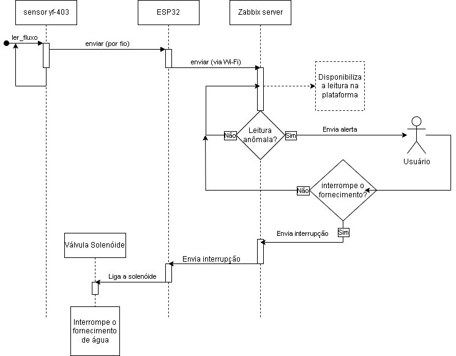

# Sistema de Monitoramento de Fluxo d’Água na Rede de Fornecimento Residencial para Detecção de Vazamentos e Desperdício de Água

## 1. Título do Projeto
**Sistema de Monitoramento de Fluxo d’Água na Rede de Fornecimento na Entrada de Residências para Detecção de Vazamentos e Desperdício de Água**

## 2. Introdução

### 2.1 Apresentação Geral do Problema e Área de Estudo
Residências, condomínios e demais edificações contam com extensas redes de tubulação para o fornecimento de água potável. Essas estruturas estão constantemente expostas à ação do tempo, variações de temperatura e à própria erosão causada pela passagem da água, o que favorece o surgimento de falhas e vazamentos ao longo do tempo. Em muitos casos, esses problemas ocorrem de forma silenciosa e progressiva, dificultando sua detecção imediata. Como consequência, a identificação de vazamentos costuma ocorrer apenas após o recebimento de uma conta de água anormalmente elevada, ou de forma subjetiva, por observações casuais dos moradores. Essa abordagem tardia e imprecisa pode levar a prejuízos financeiros e ao desperdício de um recurso essencial.

### 2.2 Objetivo Geral do Projeto
Este projeto tem como objetivo desenvolver um sistema automatizado para detecção de vazamentos na rede de fornecimento de água de residências, utilizando sensores de fluxo para coletar dados em tempo real. Através da análise de variações anômalas no padrão de consumo, o sistema visa oferecer uma resposta precisa e assertiva quanto à existência de possíveis vazamentos. Com essas informações, será possível acionar profissionais para manutenção corretiva de forma mais ágil e eficiente, contribuindo para a redução do desperdício de água e a prevenção de prejuízos.

## 3. Motivação

### 3.1 Justificativa para o Desenvolvimento do Projeto
Este projeto surge a partir das dificuldades enfrentadas por moradores do litoral norte do Rio Grande do Sul que possuem casas de veraneio. Esses proprietários geralmente passam apenas algumas semanas por ano em suas residências litorâneas, permanecendo o restante do tempo no interior do estado. Caso ocorra um vazamento ou rompimento de cano durante a ausência, o deslocamento fora de temporada para resolver o problema pode exigir centenas de quilômetros de viagem, além de causar grandes desperdícios e prejuízos. A proposta visa evitar esse cenário, permitindo que o problema seja identificado remotamente e solucionado com agilidade.

### 3.2 Relevância do Tema e Problemas que Pretende Resolver
A proposta é relevante enquanto o desperdício de água continuar sendo uma preocupação crítica para a sociedade. Ao possibilitar a detecção automatizada e remota de vazamentos, o sistema pretende reduzir significativamente a perda de água potável, que pode atingir milhares de litros por dia em casos não identificados. Além disso, transfere a responsabilidade de monitoramento do usuário para um sistema automatizado, evitando prejuízos econômicos e permitindo decisões mais assertivas.

### 3.3 Potenciais Impactos Sociais, Econômicos e Técnicos
O sistema proposto possui impactos positivos diretos. Do ponto de vista ambiental, contribui com a preservação da água ao evitar desperdícios prolongados. No aspecto econômico, proporciona economia financeira aos usuários ao evitar cobranças indevidas por consumo excessivo causado por vazamentos ocultos. Tecnologicamente, o projeto oferece uma ferramenta que facilita a identificação da necessidade de manutenção especializada, evitando danos maiores e prolongados na infraestrutura hidráulica das residências.

## 4. Descrição da Proposta

### 4.1 Detalhamento da Solução Proposta
O sistema será composto por um sensor de vazão instalado na tubulação principal de água, na entrada das residências. Esse sensor será responsável por medir continuamente o fluxo de água e enviar os dados coletados via conexão Wi-Fi para a plataforma de monitoramento Zabbix. A visualização dos dados será feita em tempo real, permitindo o acompanhamento constante do consumo de água. Caso o sistema detecte um volume de água anormal em determinado intervalo de tempo — sugerindo um possível vazamento — um alerta será gerado na plataforma. Além disso, haverá a possibilidade de interromper remotamente o fornecimento de água por meio do acionamento de uma trava mecânica, evitando maiores prejuízos.

### 4.2 Principais Funcionalidades
- Medição contínua do fluxo de água na tubulação de entrada da residência.  
- Envio e exibição dos dados em tempo real em uma plataforma web (Zabbix).  
- Geração de alertas quando os dados indicarem consumo anômalo.  
- Possibilidade de interrupção remota do fornecimento de água.

### 4.3 Abordagem e Tecnologias Utilizadas
- **Hardware:** ESP32, sensor de fluxo YF-403, válvula solenóide 12v, 2 polegadas  
- **Software (Backend):** Linguagem C utilizando o ambiente de desenvolvimento Arduino IDE  
- **Interface Web (Frontend):** Plataforma Zabbix para exibição dos dados e gerenciamento de alertas

## 5. Requisitos

### 5.1 Requisitos Funcionais
A seguir, são listadas as funcionalidades essenciais que o sistema deverá oferecer:

- Medir continuamente o volume de água que passa pela tubulação a cada segundo.
- Enviar e disponibilizar os dados coletados na plataforma de monitoramento Zabbix.
- Gerar alertas automáticos, em qualquer horário do dia, quando houver consumo de água além do esperado.
- Permitir a interrupção remota do fornecimento de água a qualquer momento por meio da plataforma web.

### 5.2 Requisitos Não Funcionais

- **Desempenho:** O sistema deve operar em tempo real, garantindo alta disponibilidade para leitura e transmissão dos dados.
- **Escalabilidade:** A arquitetura deve suportar a adição de novos sensores e o monitoramento de múltiplas residências sem perda de desempenho.
- **Confiabilidade:** Os alertas devem ser emitidos apenas em situações que realmente indiquem comportamento anômalo, minimizando falsos positivos.
- **Manutenibilidade:** O sistema deve ser projetado de forma modular e clara, facilitando atualizações e correções futuras.

## 6. Diagrama de Comunicação

O diagrama a seguir representa o fluxo de dados e a comunicação entre os componentes do sistema, incluindo o sensor de vazão, o microcontrolador ESP32, a rede Wi-Fi e a plataforma de monitoramento Zabbix.

### Descrição dos Componentes

- **Sensor de Vazão YF-403:** Responsável por medir a quantidade de água que passa pela tubulação.
- **ESP32:** Microcontrolador que lê os dados do sensor e os transmite via Wi-Fi.
- **Rede Wi-Fi:** Canal de comunicação entre o ESP32 e a internet.
- **Plataforma Zabbix:** Interface web para visualização em tempo real, geração de alertas e controle remoto do sistema.
- **Válvula Solenóide:** Componente responsavel por interromper e permitir a passagem do fluxo d'água.
